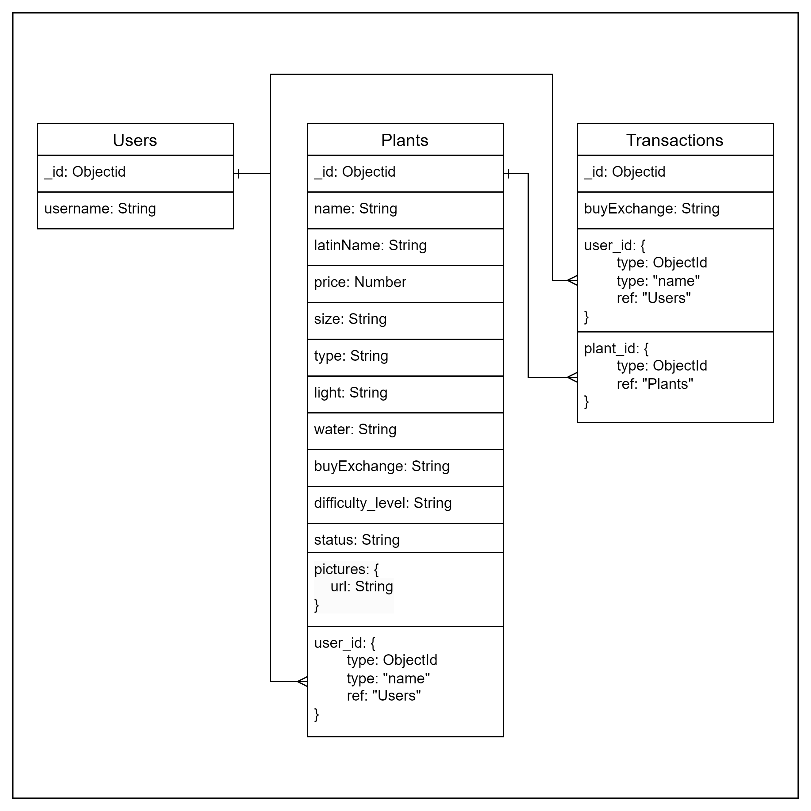

# Postman dokumentation
https://documenter.getpostman.com/view/40880370/2sAYX5M3CE

- # Har lagt in min databas som json-filer under com.example.plantswap

# Beskrivning av affärsregler
Om ägaren av plantan har angett "buy" i "buyExchange" och status är "available", så ska man kunna fylla i "buy" i transaction och kunna köpa plantan.

Detsamma gäller om ägaren har angett "exchange" i "buyExchange", den andra användaren har en plant och status är "available", så ska man kunna fylla i "exchange" i transaction och kunna byta plantan.

Man ska inte kunna ha en planta som är under 50 SEK eller över 1000 SEK

# Förbättring och begränsningar
- Skapa en service till nästa gång. Blev inte så strukturerat så jag tappade ofta bort mig i koden.
- Göra om vissa saker till enum tex. String exchange = "exchange"; i min transactionController.
- Förbättra min exchange i transactionController. Missade och tänkte fel, gjorde den på samma sätt som "buy" och missa att man skulle byta sinsemellan. Vill inte riktigt fungera som jag vill.

# E/R-DIAGRAM

